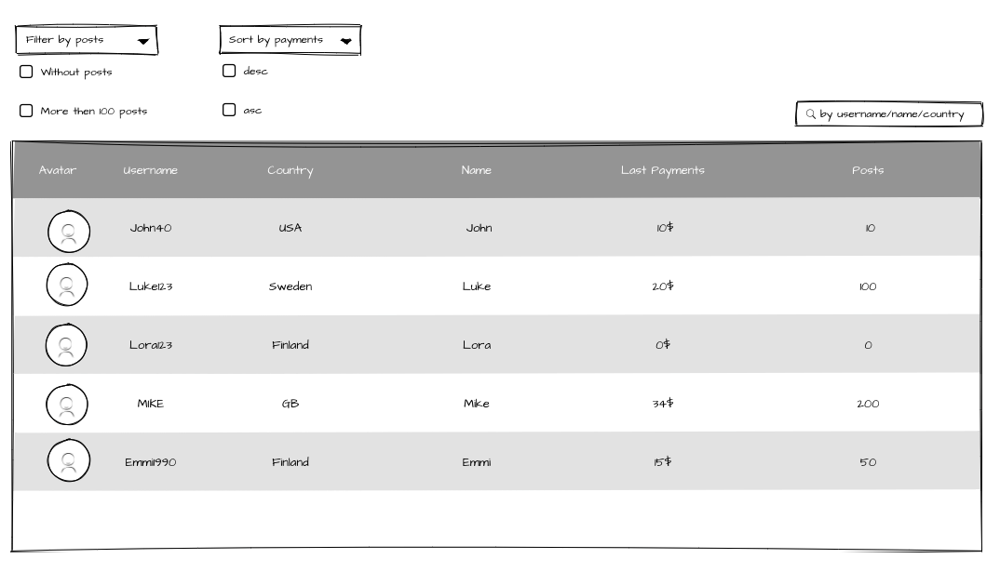
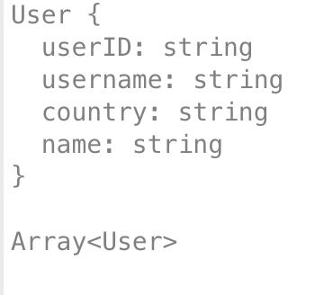
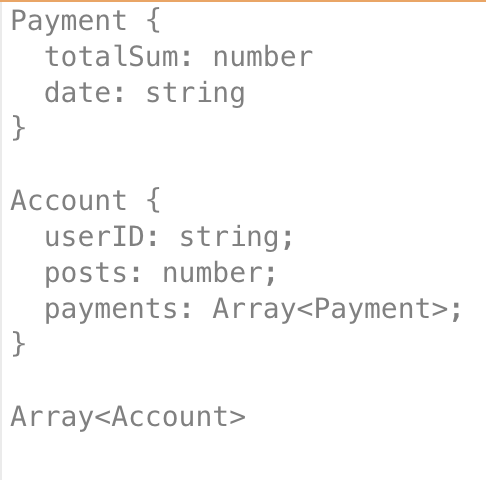
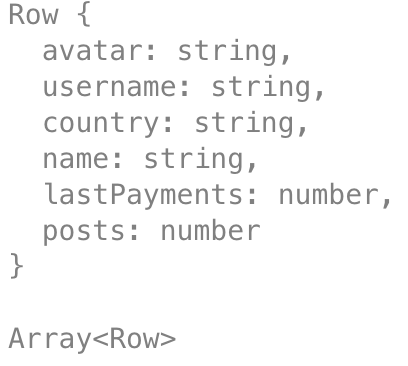
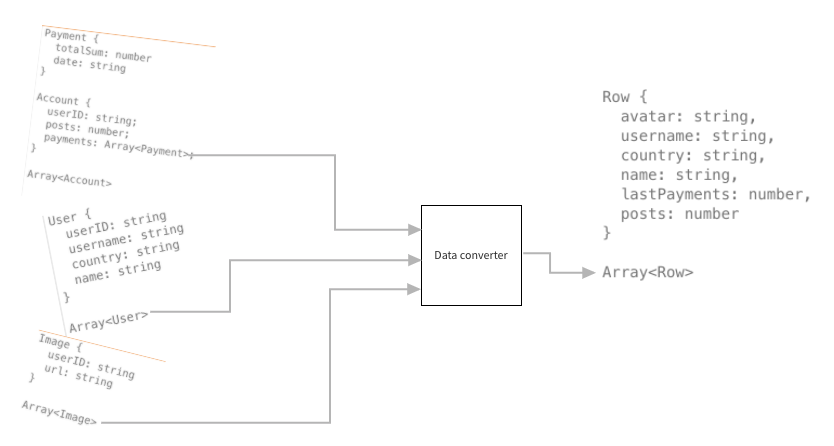
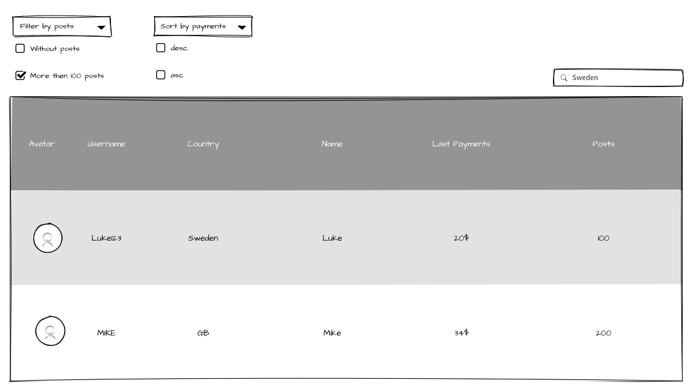
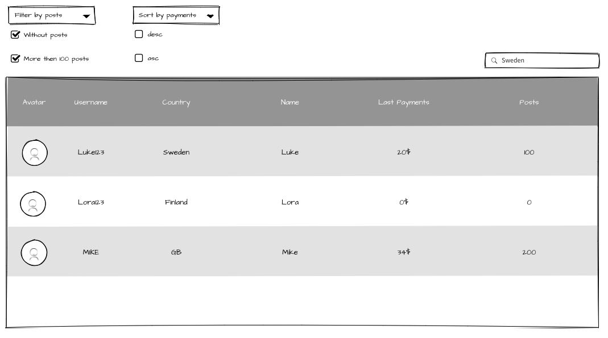
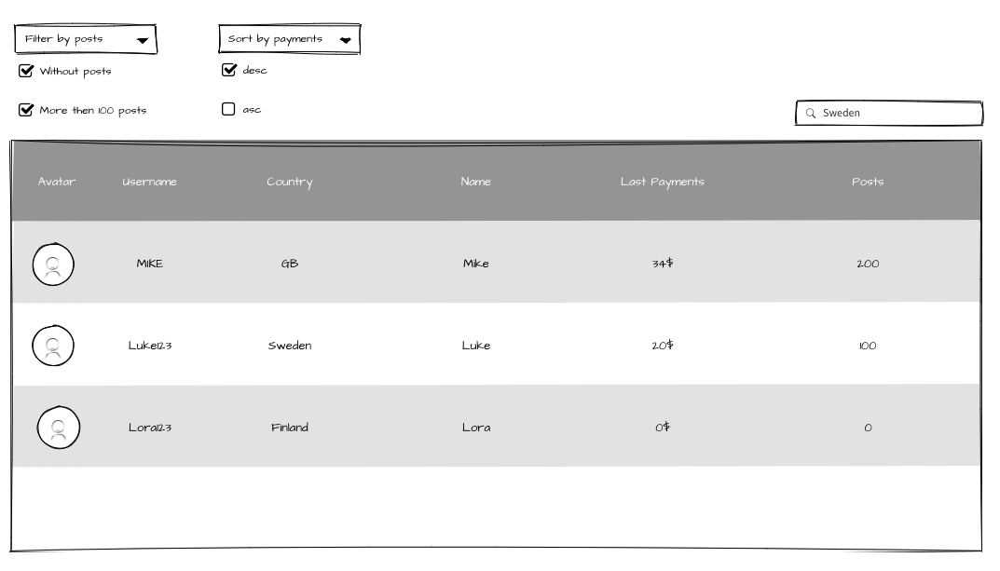

## Start the project

### clone repo

Run `git clone` [repo url](https://github.com/dianalemen/fp-hometask.git)

In the project directory, run:

### `npm install`

Installs all requered packages.

### `npm start`

Runs the app in the development mode.\
Open [http://localhost:3000](http://localhost:3000) to view it in your browser.

The page will reload when you make changes.\
You may also see any lint errors in the console.

## Task

Imagine that you work on the game server and you need to display some statistics on the UI. In order to do it, you need to get some data from the back end and then show it on the UI. 
The back-end work is done and you have 3 requests with the needed data.
On UI you already have implemented components so what you need is to pass data from API to the component and implement some business logic.

### You need to implement:

1) First part to implement is a data converter.
Like in real life there are 3 REST API endpoints and each returns an array of objects. On the UI the all of the received data should be displayed in one table (it is already implemented). However, the table takes one array with the objects (rows). So it is necessary to convert 3 arrays into 1. The response models ​are provided below.

`getImages` - returns array of images.

`getUsers` - returns array of users.

`getAccounts` - returns array of accounts.

The table takes the next array of rows as a parameter:

So the next transformation should be done:

2) Second part to implement some business logic on the page.
In the future, we will have a lot of data in the table, so it would be hard to find something in there. That is why we need to have a possibility to sort, filter, and search on the page.
  - `Sort`, `Search` and `Filter` have to work as **OR**.
  For example, if the **More than 100 posts** filter is active and you type SWEDEN in the `Search` input the result will be MIKE and Luke123.
  

  - **Without posts** and **More than 100 posts** also have to work as **OR**.
  For example, if both of them are chosen and Sweden is typed in `Search` input the result will be Lora123, Luke123 and MIKE.
  

  - If **Without posts** and **More than 100 posts** filters are active, Sweden is typed in `Search` input and you select **desc** sorting the result will be MIKE, Luke123, Lora123.
  

Remember that main idea is to follow functional programming principles, such as: 
immutability, avoiding side effects, using pure function, no shared state, using higher order component, curring, composition.

**Evaluation Criteria**

[2]. All tasks are implemented partially, or one task are not implemented at all.

[3]. Two tasks have major issues or functional principles are not followed at all.

[4]. One of the tasks does not have a major part of its implementation.

[5]. All tasks are implemented to a full extend and functional principles are followed.
